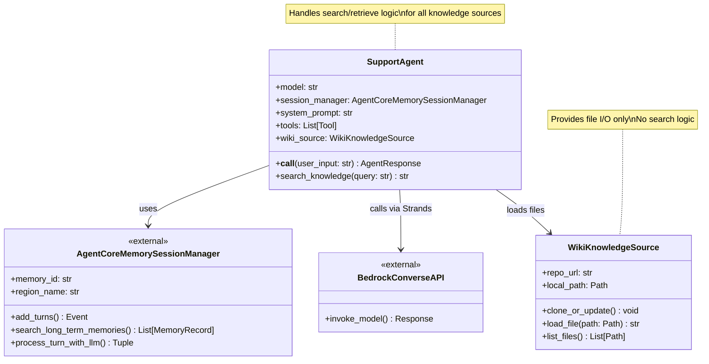
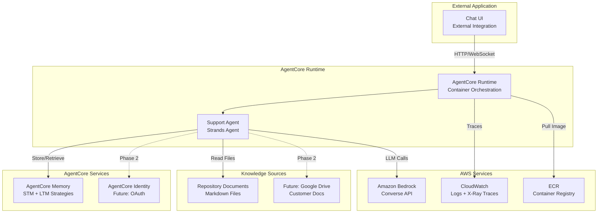
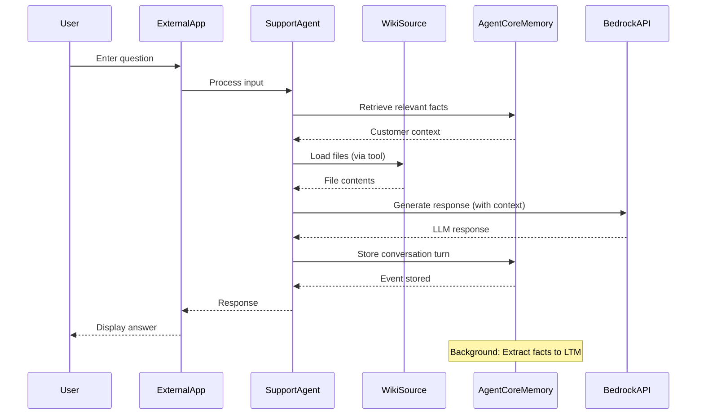

# Design Document: AWS Customer Support Agent

## Overview

This document outlines the architecture for an AWS customer support agent that serves as an alternative to traditional account managers. The design leverages **Strands Agent** for agent orchestration and **AgentCore** services for runtime, memory, and infrastructure concerns.

## Design Principles

1. **Delegate to Frameworks**: Use Strands Agent's built-in capabilities rather than building custom implementations
2. **Leverage AgentCore Services**: Utilize AgentCore Runtime, Memory, and Identity for infrastructure
3. **Separation of Concerns**: Clear boundaries between agent logic, knowledge sources, and infrastructure
4. **Minimal Complexity**: Simple, cost-effective AWS architecture
5. **Phased Implementation**: Focus on Phase 1 (basic Q&A with repository documents)

---

## 1. Class Architecture

### 1.1 High-Level Class Diagram



### 1.2 Component Responsibilities

**SupportAgent** (Strands Agent)
- Orchestrates conversation flow using Strands Agent framework
- **Owns all search and retrieve logic** for knowledge sources
- Decides which knowledge sources to query (Wiki, AgentCore Memory, future: Google Drive)
- Implements search strategies (keyword matching, semantic search, etc.)
- Aggregates and ranks results from multiple sources
- Manages tools via `@tool` decorator (no custom tool execution)
- Delegates memory operations to AgentCore Memory
- Uses Bedrock Converse API via Strands model providers

**WikiKnowledgeSource**
- **File I/O operations only** - no search logic
- Clones/updates repository using GitPython
- Loads file contents by path
- Lists available files
- Simple data access layer

**AgentCoreMemorySessionManager** (External)
- Manages short-term memory (conversation history)
- Handles long-term memory extraction (customer facts)
- Provides semantic search capabilities
- Fully managed by AgentCore

**Design Rationale**: Centralizing search/retrieve in SupportAgent enables unified handling of multiple knowledge sources (Wiki, past conversations, Google Drive, etc.) without duplicating search logic. Knowledge sources become simple data providers.

---

## 2. AWS Infrastructure Architecture

### 2.1 Infrastructure Diagram



**Note**: This repository provides the agent implementation only. The chat UI is provided by external applications that integrate with this agent via AgentCore Runtime.

### 2.2 Infrastructure Components

**AgentCore Runtime**
- Serverless container orchestration
- Auto-scaling based on demand
- Built-in X-Ray tracing
- Managed by CloudFormation

**AgentCore Memory**
- Single shared Memory resource for entire IT department
- Session ID: Per-conversation identifier (auto-generated UUID)
- Short-term memory: Conversation history per session (automatic)
- Long-term memory: Semantic extraction with dual-namespace strategy
  - **Per-User Namespaces** (isolated by `{actorId}`):
    - `support/facts/{actorId}` - User-specific AWS resources, issues
    - `support/preferences/{actorId}` - User skill level, settings
  - **Shared Company Namespaces** (accessible to all users):
    - `company/aws-environment` - Shared AWS account structure, VPCs, common resources
    - `company/policies` - Security policies, compliance requirements, best practices
- Retrieval: Semantic search from both user-specific and shared namespaces with relevance scoring

**Amazon Bedrock**
- Model: Claude Sonnet 4 (via Strands model provider)
- API: Converse API with prompt caching
- Prompt cache: Wiki file contents (first prompt)

**CloudWatch + X-Ray**
- Automatic instrumentation via AgentCore
- Transaction Search for GenAI observability
- Log aggregation for debugging

**Repository Documents**
- Source: `https://github.com/icoxfog417/personal-account-manager`
- Access: GitPython clone (no authentication needed for public repository)
- Update: Periodic pull or on-demand

### 2.3 Cost Optimization

- **AgentCore Runtime**: Pay-per-request, no idle costs
- **AgentCore Memory**: Storage + extraction costs only
- **Bedrock**: Prompt caching reduces token costs significantly
- **No Vector DB**: File-based search in Phase 1 (minimal cost)
- **No NAT Gateway**: AgentCore handles networking

---

## 3. Directory Structure

```
personal-account-manager/
├── spec/
│   ├── requirements.md          # Project requirements
│   └── design.md                # This document
│
├── agent/
│   ├── __init__.py
│   ├── support_agent.py      # SupportAgent class (Strands Agent)
│   ├── prompts.py            # Prompt and model settings for agent
│   ├── tools.py              # Tool definitions (@tool decorator)
│   └── knowledge/
│       ├── __init__.py
│       └── wiki_source.py    # WikiKnowledgeSource class
│
├── deployment/
│   ├── deployment-stack.yaml # One-click CloudFormation deployment
│   └── deploy.sh             # Deployment automation
│
├── tests/
│   ├── unit/
│   │   ├── test_agent.py
│   │   └── test_wiki_source.py
│   └── integration/
│       └── test_e2e.py
│
└── README.md                    # Project documentation
```

### 3.1 Key Files

**agent/support_agent.py**
- SupportAgent class (Strands Agent)
- Implements search/retrieve logic for all knowledge sources
- Defines tools using `@tool` decorator

**agent/knowledge/wiki_source.py**
- WikiKnowledgeSource class
- Provides file I/O operations only (clone, load, list)

**infrastructure/deployment-stack.yaml**
- One-click CloudFormation deployment
- Provisions AgentCore Runtime, Memory, and supporting resources
- Includes LaunchStack button integration

---

## 4. Data Flow

### 4.1 Conversation Flow



## 5. Deployment Strategy

### 5.1 One-Click Deployment with CloudFormation

**LaunchStack Button**
- Users click LaunchStack button in README
- CloudFormation template provisions all resources
- CodeBuild project clones repository and deploys agent
- SNS notifications sent to user email on completion

**CloudFormation Resources**
- AgentCore Runtime (container orchestration)
- AgentCore Memory (with LTM strategies)
- ECR Repository (container images)
- IAM Roles (execution permissions)
- CodeBuild Project (build and deployment)
- SNS Topic (deployment notifications)
- CloudWatch Log Groups (observability)

**Deployment Flow**
1. User clicks LaunchStack button
2. CloudFormation creates CodeBuild project
3. CodeBuild clones this repository
4. CodeBuild builds Docker image
5. CodeBuild pushes image to ECR
6. CodeBuild deploys to AgentCore Runtime
7. CodeBuild clones wiki repository
8. SNS sends completion notification with endpoint URL

### 5.2 CloudFormation Template Structure

Based on reference templates (GenU, AIAgentDev), the deployment stack includes:

**Parameters**
- NotificationEmailAddress: Email for deployment notifications
- Environment: dev/staging/prod
- ModelRegion: Bedrock model region
- WikiRepoUrl: GitHub wiki repository URL

**Resources**
- DeploymentNotificationTopic: SNS topic for notifications
- CodeBuildServiceRole: IAM role with necessary permissions
- DeploymentProject: CodeBuild project for agent deployment
- DeploymentTrigger: Lambda custom resource to start build
- TriggerFunction: Lambda to invoke CodeBuild

**BuildSpec in CodeBuild**
- Install dependencies (Python, Node.js, AgentCore CLI)
- Clone wiki repository
- Build Docker image
- Deploy to AgentCore using `agentcore launch`
- Send completion notification via SNS

---

## 6. Phase 1 Implementation Focus

### 6.1 In Scope

✅ Agent implementation (no chat UI in this repository)
✅ Repository document integration (clone + file search)
✅ Conversation memory (STM + LTM via AgentCore)
✅ Basic Q&A with context retrieval
✅ Strands Agent with `@tool` decorator
✅ AgentCore Memory with semantic strategy
✅ Bedrock Converse API with prompt caching
✅ One-click CloudFormation deployment

### 6.2 Out of Scope (Phase 2)

❌ Chat UI (provided by external applications)
❌ Email interface
❌ Command execution (billing alerts, credit application)
❌ External knowledge sources (Google Drive)
❌ AgentCore Identity integration
❌ Advanced personalization
❌ Multi-agent orchestration

---

## 7. Key Design Decisions

### 7.1 Why Strands Agent?

- **Built-in tool management**: `@tool` decorator handles tool execution
- **Session management**: Integrates with AgentCore Memory seamlessly
- **Model flexibility**: Easy to swap LLM providers
- **Streaming support**: Ready for real-time responses

### 7.2 Why AgentCore Memory?

- **Managed service**: No infrastructure to maintain
- **Automatic extraction**: LTM strategies run in background
- **Semantic search**: Built-in vector search capabilities
- **Scalable**: Handles multiple users/sessions

### 7.3 Why File-Based Document Search (Phase 1)?

- **Simplicity**: No vector DB setup/cost
- **Sufficient for MVP**: Documentation is small, keyword search works
- **Fast iteration**: Focus on agent logic, not infrastructure
- **Upgrade path**: Can add vector search in Phase 2

### 7.4 Why No Custom Tool Execution?

- **Strands handles it**: `@tool` decorator provides all needed functionality
- **Less code**: No need to build tool registry, validation, error handling
- **Better integration**: Works seamlessly with AgentCore Runtime

---

## 8. Success Metrics

### 8.1 Technical Metrics

- Response latency: < 3 seconds (p95)
- Memory retrieval accuracy: > 80% relevant facts
- Document search relevance: > 70% helpful results
- System uptime: > 99.5%

### 8.2 Business Metrics

- Customer satisfaction: > 4/5 rating
- Issue resolution rate: > 60% without escalation
- Cost per interaction: < $0.10
- Adoption rate: > 50% of target customers

---

## 9. Future Enhancements (Phase 2+)

### 9.1 Email Interface

- Receive questions via email (SES)
- Parse email content and attachments
- Send formatted responses with links

### 9.2 Command Execution

- Billing alert setup (CloudWatch alarms)
- Credit application workflow (Step Functions)
- Payment method changes (AWS Billing API)
- Approval workflows for sensitive operations

### 9.3 Enhanced Knowledge Sources

- Google Drive integration (AgentCore Identity)
- Customer-specific documentation
- Real-time AWS service status
- Internal knowledge bases

### 9.4 Advanced Personalization

- Learning from interaction patterns
- Proactive suggestions based on usage
- Custom response styles per customer
- Multi-language support

---

## 10. Risks and Mitigations

| Risk | Impact | Mitigation |
|------|--------|------------|
| Document content quality | High | Curate documentation, add validation |
| LLM hallucinations | High | Prompt engineering, fact-checking |
| Memory extraction accuracy | Medium | Tune strategies, monitor quality |
| Cost overruns | Medium | Set budgets, monitor usage |
| Slow response times | Medium | Optimize prompts, use caching |
| Security concerns | High | Use AgentCore Identity, audit logs |

---

## Conclusion

This design leverages Strands Agent and AgentCore services to build a scalable, cost-effective AWS customer support agent. By delegating infrastructure concerns to managed services and focusing on agent logic and knowledge integration, we can rapidly iterate and deliver value to customers who lack dedicated account manager support.

The phased approach ensures we validate core functionality (Phase 1) before adding complexity (Phase 2), while the architecture remains flexible enough to accommodate future enhancements.
